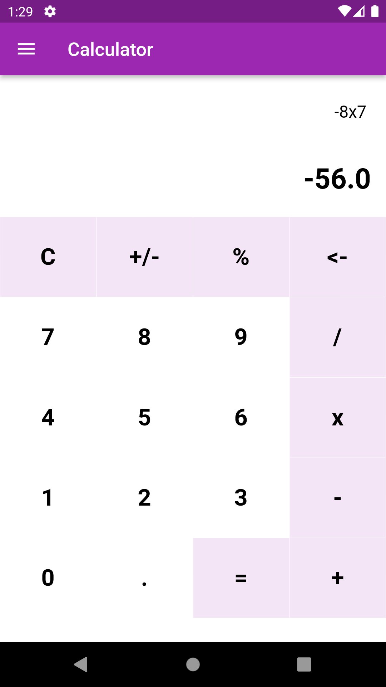

# my_calculator
This is my first Project as i am starting my journey to learn App Development using Flutter.
# features
->Performs Simple Mathematical Calculations.
->Changes themes based on system settings.
->Cross Platform App (Built using Flutter Framework)

# screenshots
-> Android Interface

     

-> Web Interface

